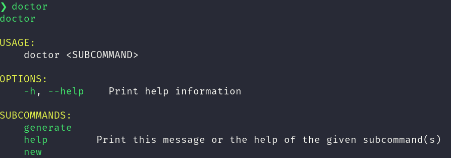
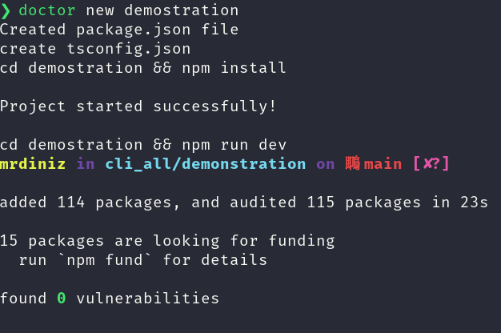
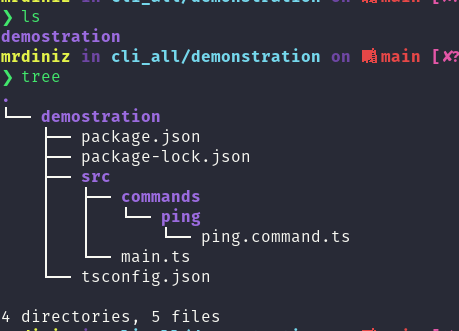
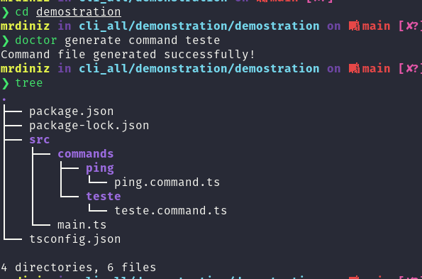
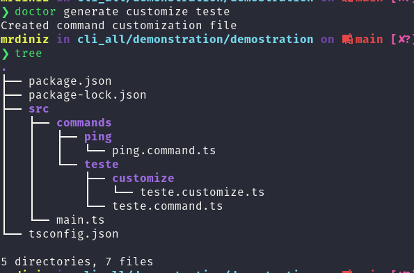

# DoctorTS framework CLI for termux

<br/>

## How to get the CLI?

```shell
npm install -g @doctorts/cli-termux
```

<br/>

## How to use?

<br>

### The CLI has a "help" command to help you find what you want!

```shell
doctor --help
```

<br/>



<br/>

### The "new" command is used to generate a new project!

```shell
doctor new project
```

<br/>



<br/>



<br />

### The "generate" command has two options! 

#

- One of which is the "command" option, which is used to generate a new pre-shaped command file for your bot!

```shell
doctor generate command command_name
```



<br />

- The other is the "customize" command, which will generate a folder and a file for customizing decorators!

```shell
doctor generate customize command_name
```



<br/>

#

## This CLI is part of a Brazilian project developed by [Mr.Diniz](https://github.com/mrdiniz88), this project has more integrated repositories, among them is the main part of the project [@doctorts/core](https://github.com/doctorts/core) and the library [@adiwajshing/baileys](https://adiwajshing.github.io/Baileys/).

<br/>

#

<br/>

### You should take a look!

* https://github.com/doctorts/cli-win
* https://github.com/doctorts/cli-termux
* https://github.com/doctorts/cli-linux
